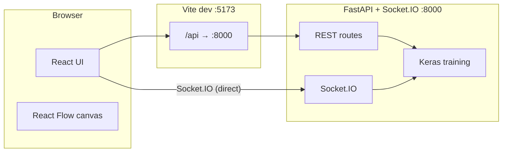

# TensorMap (GSoC Edition)

A **visual neural network studio** prototype: drag-and-drop layers on a canvas (React Flow), compile the graph to **Keras** on the server, **train** on built-in datasets with **live metrics** over **Socket.IO**, and **export** weights (SavedModel, ONNX, TFLite) or human-readable **PDF / Word** reports.

---

## What’s included

| Area | Details |
|------|--------|
| **Frontend** | React 18, Vite, TypeScript, React Flow, Recharts, Socket.IO client |
| **Backend** | FastAPI, SQLModel (SQLite by default), python-socketio, background training |
| **ML** | TensorFlow/Keras graph compile, MNIST/CIFAR-10/Fashion-MNIST/Boston training |
| **Export** | SavedModel folder, `.onnx`, `.tflite`; optional **PDF/Word** experiment summaries (`fpdf2`, `python-docx` in core requirements) |

---

## Architecture



- **HTTP API** (layers, graphs, training, export) is usually called via Vite’s **`/api` proxy** to `localhost:8000`.
- **Socket.IO** connects **directly** to the API origin (default `http://localhost:8000`) because it is not proxied by Vite.

---

## Repository layout

Tracked **source** layout (as in version control). Runtime artifacts are listed under [Generated / ignored](#generated--ignored-local-artifacts) below.

```
PRototype/
├── README.md
├── .gitignore
│
└── tensormap/
    │
    ├── backend/                         # FastAPI + Socket.IO + Keras
    │   ├── main.py                      # FastAPI app, CORS, mounts `socketio.ASGIApp(sio, app)`
    │   ├── database.py                  # SQLModel engine, `get_session`, SQLite default
    │   ├── models.py                    # ModelGraph, TrainingRun, ExportedModel
    │   ├── layer_registry.py            # Canonical Keras layer metadata → GET /api/layers
    │   ├── graph_compiler.py            # Topological compile: nodes + edges → tf.keras.Model
    │   ├── ml_runtime.py                # Lazy TensorFlow import (optional-ML startup)
    │   ├── trainer.py                   # model.fit, Socket.IO `training_*` events, callbacks
    │   ├── exporter.py                  # SavedModel / ONNX / TFLite writers
    │   ├── report_export.py             # PDF + DOCX experiment reports
    │   ├── start.sh                     # Install deps + uvicorn (conda env or .venv)
    │   ├── RUN.txt                      # Copy/paste-safe run instructions
    │   ├── requirements.txt             # Aggregator: `-r` core + ml
    │   ├── requirements-core.txt        # FastAPI, SQLModel, socketio, fpdf2, python-docx, …
    │   ├── requirements-ml.txt          # TensorFlow, tf2onnx, onnx
    │   ├── requirements-docs.txt        # `-r requirements-core.txt` (alias for older docs)
    │   ├── requirements-postgres.txt    # Optional PostgreSQL driver
    │   │
    │   └── routers/
    │       ├── __init__.py
    │       ├── layers.py                # GET /api/layers
    │       ├── training.py              # POST /api/graphs, training start + training CRUD
    │       └── export.py                # POST /api/export, GET download
    │
    └── frontend/                        # Vite + React + TypeScript
        ├── index.html                   # SPA entry
        ├── package.json
        ├── package-lock.json
        ├── vite.config.ts               # Dev server :5173, proxy /api → :8000
        ├── tsconfig.json
        ├── tsconfig.node.json
        │
        └── src/
            ├── main.tsx                 # React root, axios base URL, StrictMode
            ├── App.tsx                  # Shell: palette, canvas, training, export
            ├── index.css                # Global + layout + layer-node + training + React Flow tweaks
            ├── config.ts                # VITE_SOCKET_ORIGIN (default http://localhost:8000)
            ├── paletteDnD.ts            # Drag data fallback for palette → canvas
            │
            ├── components/
            │   ├── Canvas.tsx           # ReactFlowProvider, drop handling, graph ref API
            │   ├── LayerNode.tsx        # Custom node: params + handles
            │   ├── LayerPalette.tsx     # Draggable registry list
            │   ├── TemplateStrip.tsx    # Static architecture hints (MNIST, CNN, sequence)
            │   ├── TrainingPanel.tsx    # Config form, start train, status, poll + socket
            │   ├── TrainingChart.tsx    # Recharts loss/accuracy curves
            │   └── ExportPanel.tsx      # SavedModel / ONNX / TFLite / PDF / DOCX buttons
            │
            ├── hooks/
            │   ├── useLayerRegistry.ts   # GET /api/layers on mount
            │   └── useSocket.ts          # Socket.IO client, `training_*` subscriptions
            │
            ├── types/
            │   └── index.ts             # LayerDefinition, LayerNodeData, TrainingConfig, metrics types
            │
            └── vite-env.d.ts            # Vite client types / `import.meta.env`
```

### Generated / ignored (local artifacts)

These are **not** part of the portable source tree; they appear after running the app and are listed in `.gitignore` (or should stay untracked).

| Path (under `tensormap/backend/`) | Purpose |
|-------------------------------------|--------|
| `tensormap.db` | Default SQLite database (graphs, runs, export records) |
| `checkpoints/` | `run_<id>.weights.h5` after successful training |
| `exports/` | SavedModel dirs, `.onnx`, `.tflite`, `.pdf`, `.docx` from export API |
| `__pycache__/` | Python bytecode |
| `.venv/` | Optional local virtualenv |

| Path (under `tensormap/frontend/`) | Purpose |
|-------------------------------------|--------|
| `node_modules/` | npm dependencies |
| `dist/` | Production `npm run build` output |

---

## Prerequisites

- **Node.js** 18+ (for the frontend).
- **Python 3.10–3.12** recommended for TensorFlow wheels (see `requirements-ml.txt`; **avoid 3.13+** unless you know your TF build supports it).
- **conda** (recommended on macOS) or a local **`.venv`** under `tensormap/backend/`.

---

## Quick start

### 1. Backend

```bash
cd tensormap/backend
```

**Option A — scripted (conda env `tensormap` or `./.venv`):**

```bash
bash start.sh
```

**Option B — manual:**

```bash
python -m venv .venv
source .venv/bin/activate   # Windows: .venv\Scripts\activate
pip install -r requirements-core.txt -r requirements-ml.txt
python -m uvicorn main:socket_app --host 127.0.0.1 --port 8000
```

Confirm the API: open [http://127.0.0.1:8000/api/layers](http://127.0.0.1:8000/api/layers).

> First TensorFlow import can take **10–30 seconds**. Wait until uvicorn prints that it is running.

### 2. Frontend

```bash
cd tensormap/frontend
npm install
npm run dev
```

Open [http://localhost:5173](http://localhost:5173).

---

## Environment variables

### Frontend (Vite)

Create `tensormap/frontend/.env.local` if defaults differ:

| Variable | Purpose | Default |
|----------|---------|--------|
| `VITE_API_BASE` | Axios base URL | `''` (use relative `/api` + Vite proxy) |
| `VITE_SOCKET_ORIGIN` | Socket.IO server URL | `http://localhost:8000` |

If the API runs on another host/port, set **both** appropriately (REST calls may use `VITE_API_BASE`; sockets **must** reach the same process that serves Socket.IO).

### Backend

| Variable | Purpose |
|----------|--------|
| `DATABASE_URL` | SQLModel database (defaults to SQLite file in backend dir) |

Optional **PostgreSQL**: install `requirements-postgres.txt` and set `DATABASE_URL=postgresql://...`.

---

## Using the studio (typical flow)

1. **Registry** — Left sidebar loads layers from `GET /api/layers`.
2. **Build** — Drag layers onto the canvas. Connect **orange (source)** → **teal (target)**, or click-connect.
3. **MNIST checklist** — `Input` shape `28,28,1` → `Flatten` → `Dense` with **units `10`** and **`softmax`** if loss is `categorical_crossentropy` (labels are 10-class one-hot).
4. **Train** — Right panel: dataset, epochs, optimizer, etc. → **Run training**. Metrics stream over Socket.IO; HTTP polling backs up status if sockets fail.
5. **Export** — After a **successful** run: SavedModel / ONNX / TFLite (binary, for apps); **PDF / Word** (readable summary of graph + config + metrics).

---

## HTTP API (summary)

| Method | Path | Role |
|--------|------|------|
| `GET` | `/api/layers` | Layer registry JSON |
| `POST` | `/api/graphs` | Save graph (nodes + edges) |
| `POST` | `/api/training/start` | Queue training (`graph_id`, `config`, `dataset`) |
| `GET` | `/api/training/{run_id}` | Run status + `metrics_history` |
| `POST` | `/api/export` | Body: `run_id`, `format`: `savedmodel` \| `onnx` \| `tflite` \| `pdf` \| `docx` |
| `GET` | `/api/export/{export_id}/download` | Download artifact |

Socket.IO events (client may filter by `run_id`): `training_started`, `training_update`, `training_complete`, `training_error`.

---

## Production / split hosts

- Build the frontend: `npm run build` → serve `dist/` behind any static host.
- Point **`VITE_API_BASE`** (at build time) to the public API origin if it is not same-origin.
- Ensure **`VITE_SOCKET_ORIGIN`** matches the **Socket.IO** endpoint (CORS is open on the sample backend; tighten for production).

---

## Troubleshooting

| Issue | What to check |
|--------|----------------|
| Registry error in UI | Backend running? `GET /api/layers` reachable? |
| Drag-drop fails | Prefer Chrome; hard-refresh. Canvas wrapper handles drops. |
| Training stuck on first epoch | Normal for MNIST **download** + TF compile (minutes). Status shows elapsed time; after **5s** without metrics the UI shows setup-phase copy. |
| Metrics never appear | Socket.IO to **port 8000**? Ad blockers / wrong `VITE_SOCKET_ORIGIN`? Poll still updates status on `/api/training/{id}`. |
| Shape / loss errors | Final `Dense` **units** must match classes (e.g. **10** for MNIST + `categorical_crossentropy`). |
| ONNX/TFLite won’t “open” | They are **runtime** formats, not documents. Use **PDF/Word** export for reading. |
| PDF export errors | `fpdf2` and `python-docx` are in `requirements-core.txt`; reinstall in the **same** env as uvicorn. |
| `pip install tensorflow` fails | Use **Python 3.12** (conda) per `requirements-ml.txt` notes. |

---

## Development scripts

```bash
# Frontend
cd tensormap/frontend && npm run dev    # dev server
cd tensormap/frontend && npm run build  # production bundle

# Backend
cd tensormap/backend && bash start.sh
# or: python -m uvicorn main:socket_app --host 127.0.0.1 --port 8000
```

---

## License

Prototype / demonstration project—add a license if you publish or contribute upstream.
